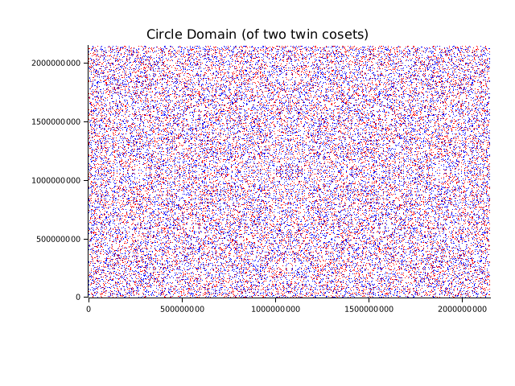

# CSTARK primer

## First steps

Clone the repo if not yet and try to run `./poseidon_benchmark.sh` in your shell. Everything should go smooth and you will see logs in the stdout. You would see terms like "Trace", "Interpolation", "Commitment", "Composition", "FRI". No worries if they are too vague now.

Check out the contents of `./poseidon_benchmark.sh` - which compilation features are used and what test is run. Let's check the contents of `test_simd_poseidon_prove`. Note from the name that this example already uses [SIMD instructions](https://github.com/rust-lang/portable-simd/blob/master/beginners-guide.md). As the name of the test also contains "prove", let's stop here a little. In ZK it is common to distinguish between proofs in a rigorous math sense and *arguments of knowledge* (probabilistically true). And that there are a *prover* (who produces a proof or an argument) and a *verifier* (who checks the proof/argument for truth).

> [Poseidon2](https://eprint.iacr.org/2023/323.pdf) is a hash function specifically designed to be used in proof systems (to have as least constraints as possible - more on it later - *arithmetization-oriented hash functions* or *circuit-friendly*). If we would use a more usual hash function like SHA256, it's representation involves much more gates to prove it (so the proving overhead is very significant). Hash functions are heavily used (especially in the web3 context) and are computations-heavy. So they are a natural target for optimized circuits and a natural target for benchmarks (as Poseidon2 hash function is widely used in Ethereum???).

Basically, we are re-running the same experiment as in [this video](https://x.com/StarkWareLtd/status/1807776563188162562) (the number of proofs in the video is 64 which means that LOG_N_INSTANCES=8 and each proof proves 2^16 poseidon hashes). In our benchmark LOG_N_INSTANCES=18.

Let's try to focus on a big picture for now. So we have two parties and two routines `prove_poseidon` and `verify`.

Arithmetization (execution trace as a polynomial)
Composition polynomial - constraints + trace polynomial
FRI

## Prover (`prove_poseidon`)

There are some precomputation steps (`SimdBackend::precompute_twiddles`) and protocol setup (a channel for non-interactivity, a polynomial commitment scheme) we will return to them later. Now let's focus on the *trace*.

### Trace (`gen_trace`)

So our goal here is to prove the computation of a poseidon2 hash function. Prove via the math. So we need to transform our computation into some math form (the process called *arithmetization*). The appoach taken in many proof systems is to define a machine with T registers (which track the computation state), execute the computation and record the computation trace as a journal of state changes (say N). So we have a matrix NxT of N rows (state changes) and T columns (registers which store state variables).

If we represent every column of the trace with a low-degree polynomial (def(f) < N), then enforce constraints (boundary and transition ones) over the trace using these column polynomials (stop: we can have a no-zk and non-succinct proof here).
We would like to utilize low-degree testing as a verification strategy for succinctness. What if we combine constraints and column polynomials, get constraints polynomials. These constraints polynomials let's divide with vanishing polynomials (basically roots of columns polynomials) and get quotients polynomials (of degree = degree of constraints polynomials - N), weight them (with random weights from verifier) to obtain their linear combination called a composition polynomial. Because we obtained the quotient polynomials by dividing with vanishing polynomials, we cannot evaluate the composition polynomial (without division by zero) over the initial multiplicative group domain so we an extension domain (a disjoint set which doesn't contain points from the trace domain). Q(X) = C(X)/Z(X); P(X) = a1 Q1 + a2Q2 + ..
The idea to divide the constraints polynomials is due to:
1) to transform the initial problem to low degree testing and checking that the constraints (as a consequence and a composition) polynomials enforce that constraints hold. Constraints hold only for the roots of vanishing polynomials (i.e. the trace domain). If we divide the constraint polynomial with some non-root, then the ratio cannot be a polynomial (we know from the school math that we can decompose a polynomial into multilpier only for its roots so we can reduce the polynomial only by dividing with its roots)
2) 

 then the resulting composite constraints polynomial should also be of the low degree. (so we transformed the idea of computation integrity from direct computation to algebraic constraints over column polynomials to low degree testing of a composition polynomial). At every such a transformation we need to prevent cheating via commitments. I.e. the malicious prover can just provide some crafted values.
 The prover commits constraint polynomials and trace polynomials evaluated over the evaluation domain. With these committed values the verifier can calculate Q(X)*C(X) and it should be a vanishing polynomial.
 If the malicious prover will try to construct a false composition polynomial, it will equal the true composition polynomial at most at degree N (the trace length). LOw degree testing is required otherwise high degree polynomials can fit any set of points (including the evaluation domain). We can test low degree by N+1 queries. And we should expect to find a non-zero value?? O(N) time. With FRI we can do better for O(logN) time. If after logN steps we didn't receive the constant polynomial, the original one wasn't of low degree. In exactly logN steps (otherwise it would be possible to cheat with a high degree polynomial via cancelling some items with a chosen weight) with high probability (holds with a large field)
 So either we check these polynomials at every point of the evaluation domain (which is not succint) or we make random queries. In case of random queries we need a larger field to decrease the probability of a false statement (soundness). But as we need to limit an ability of a malicious prover to search for predefined parameters of the fake proof, we need a large search space. So we need a large field (extending the base field) for PCS to make the scheme secure.

>  The prover could sent the execution trace to the verifier (ignoring zero-knowledge for now) and the verifier checks the constraints over the execution trace. But such a solution lacks *succinctness*.

Let's look at the signature of `gen_trace`:

```rust
pub fn gen_trace(
    log_size: u32,
) -> (
    ColumnVec<CircleEvaluation<SimdBackend, BaseField, BitReversedOrder>>,
    LookupData,
)
```

It takes `log_size` - a logarithm of a number of rows `N`
The trace matrix is represented by the [`ColumnVec`](crates/prover/src/core/mod.rs) (length of a number of rows `N` - `2^log_size`) of columns [`Column`](crates/prover/src/core/backend/mod.rs). The trait implementation is parametrized by a backend (`SimdBackend`) and a field (`BaseField`). Let's start with the latter.

All operations with numbers are performed over some *field*. 

> Field is an algebraic structure over a set of some objects (*field elements* or *felts* for short) with defined operations of addition and multiplication closed over the set (i.e. adding or multiplying two felts results in the felt belonging to the same set); every non-zero element has a multiplicative inverse. For example, fields generalize the set of real numbers (R) and allow to deduce some general laws (e.g. the associative law) for felts of some general nature.

Why fields and not real numbers? Real numbers involve rounding errors due to their representation in a computer. Moreover, the result of an operation (addition/multiplication) is unbounded. 

A much more natural fit for current CPU architectures is a finite prime field, Fp. (A prime number p has no divisors except 1 and itself). All operations in such a field are done modulo p so the set of possible felts is {0, 1, ..., p-1}.

> Refresher on [The Integers mod n](http://abstract.ups.edu/aata/groups-section-mod-n-sym.html)


Mersenne primes (primes of the form `2^n - 1`) are of binary-friendly structure. E.g. modulo reductions (`n % p` where n is an integer) can be done using addition and bit operations (check [`impl M31`](crates/prover/src/core/fields/m31.rs)) as division operations are costly.  Mersenne prime `2^31 - 1` (usually denoted as M31) perfectly fits `u32` which means it can be efficiently operated by both CPU and GPU (as a 4-byte unsigned integer). [`BaseField`](crates/prover/src/core/fields/m31.rs) is M31 (in the current implementation it is a wrapper around `u32` with some field-specific methods).

> So the choice of a finite field instead of real numbers is a common technique to have performant arithmetic operations.

In the `prove_poseidon` we can see `SimdBackend`. So the idea is to provide different backends ([cpu](./crates/prover/src/core/backend/cpu/), [simd](./crates/prover/src/core/backend/simd/), [GPU](https://github.com/NethermindEth/stwo-gpu)) to basic field operations. For example, in our the first method is [`precompute_twiddles`](./crates/prover/src/core/backend/simd/circle.rs) of the trait [`PolyOps`](./crates/prover/src/core/poly/circle/ops.rs).

> In our SIMD poseidon benchmark columns are vectors of `PackedBaseField` - Rust stdlib [`Simd`](https://doc.rust-lang.org/stable/std/simd/struct.Simd.html) structure which allow to operate with `[u32; N_LANES]` felts at once ([`N_LANES`](crates/prover/src/core/backend/simd/m31.rs) is 2^4, 16*32 is 512, in Intel it is AVX512). So basically trace columns are matrices themselves of N rows (as the trace) and 16 columns. But for the next part it is easier to think of it as vectors of length `N * 16` where we move by 16 rows at once.

We won't go into details how Poseidon2 works (see `apply_external_round_matrix`, `apply_internal_round_matrix`, `apply_m4` and the relevant paper). We just treat it as some permutations to the state.

In the main loop of `gen_trace` for every row (remember that we step by 16 simultaneous rows due to SIMD) and for every instance (out of 8) in row (columns ranges are relative to each instance)
1. copy the initial state values into the first 0..16 trace columns (16 values)
2. apply 4 full rounds of hash function logic to the state (16 values) and copy these updated state values into the next 16..80 trace columns (4*16 values)
3. apply 14 partial rounds of hash function logic to the first element of the state (1 value) and copy these updated state values into the next 80..94 trace columns (14 values)
4. apply 4 full rounds of hash function logic to the state (16 values) and copy these updated state values into the next 94..158 trace columns (4*16 values)

As we have 8 (`N_INSTANCES_PER_ROW`) instances in a row and 158 (`N_COLUMNS_PER_REP`) state registers per instance, then totally we have 1264 felts (`N_COLUMNS`) in a row of the trace. As a reminder, every felt consists of 16 `u32` values (as it is a simd version).

After the loop we see the evaluation of the trace over [`CircleDomain`](crates/prover/src/core/poly/circle/domain.rs).

The input of a computation is called a *witness*.

The input to the poseidon2 hash function matches the expected output iif the algebraic intermediate representation (AIR) polynomial constraints are satisfied.

### Circle curve

Integrity of the original computation is transformed into proving that the AIR constraints are satisfied. The process of reducing the computation trace to the set of the polynomial constraints is named *arithmetization*.

So we treat each column of the computation trace as values of a polynomial over the `CircleDomain`. The circle domain is represented by values of a multiplicative group. So if X is a current row, then wX is the next row where w is a generator.

When we define constraints, we can move both along the columns and along the rows.
Then every constraint (which may include values of several polynomials) is representated as a rational function (think of moving along the rows).
The variables are column polynomials.

If we have a solution to the system of constraints (i.e. we know column polynomials), it means that we now the solution of the original computation program. But we can say that we have a solution but provide another object instead of polynomials (e.g. rational fractions). So we also need to prove that solution consists of polynomials.

So we treat the trace columns as an image (values) of a polynomial fi defined of the domain over the unit circle. Informally, fi: CircleDomain -> Column
As a quick refresher on domain and image of the mapping(function) see [Cartesian Products and Mappings](http://abstract.ups.edu/aata/ssets-ection-sets-and-equivalence-relations.html).

The circle curve is defined by the equation x^2 + y^2 = 1, where x and y come from the finite prime field. At the current stage of the proof the field is M31. The circle curve is represented by [`struct CirclePoint`](crates/prover/src/core/circle.rs) and 


> Why do we need this Circle over the Field at all? Why not work direclty over the field? The reason is that M31 is not FFT-friendly - more on it later.

> [Groups](http://abstract.ups.edu/aata/groups-section-defnitions.html)
> [Subgroups](http://abstract.ups.edu/aata/groups-section-subgroups.html)
> [Coset](http://abstract.ups.edu/aata/cosets-section-cosets.html)

If we follow the nested structs of `CanonicCoset::new(log_size).circle_domain()`, we come up to [`Coset`](../crates/prover/src/core/circle.rs).

`CanonicCoset` is constructed from [`Coset::odds(log_size)`](../crates/prover/src/core/poly/circle/canonic.rs) which in turn includes `CirclePointIndex::subgroup_gen(log_size)`.
Let's explore the latter:

```rust
pub const M31_CIRCLE_LOG_ORDER: u32 = 31;

pub fn subgroup_gen(log_size: u32) -> Self {
    assert!(log_size <= M31_CIRCLE_LOG_ORDER);
    Self(1 << (M31_CIRCLE_LOG_ORDER - log_size))
}
```

So the circle order is 2^31. We need to extract a subgroup from the whole field s.t. the subgroup order (i.e. the number of elements in the subgroup) is equal to the trace length (as column polynomials are evaluated over field elements which constitute a multiplicative group - we need to easily obtain any domain point via multiplying by the subgroup generator).

In one of the `Coset` constructors:

```rust
pub fn odds(log_size: u32) -> Self {
    let generator = CirclePointIndex::subgroup_gen(log_size + 1);
    Self::new(generator, log_size)
}
```

So we divide the size of the whole field 2^31 by the doubled length of the trace 2^(15+1) to get the subgroup generator 2^15 (or 32_768). Basically, we have 2^31 elements and we would like to find a step (generator) which equally distributes 2^15 points over 2^31 units. As we also add 1 to the log_size, it means we get a half-step.

```rust
impl Coset {
    pub fn new(initial_index: CirclePointIndex, log_size: u32) -> Self {
        assert!(log_size <= M31_CIRCLE_LOG_ORDER);
        let step_size = CirclePointIndex::subgroup_gen(log_size);
        Self {
            initial_index,
            initial: initial_index.to_point(),
            step: step_size.to_point(),
            step_size,
            log_size,
        }
    }
}
```

This half-step 2^15 (or 32_768) goes as an initial index into `Coset` constructor, while the step size is 2^16 (65_536).

So we can enumerate rows of the trace with the following circle point indices:

```
2^15 (32_768)
2^15 + 2^16*1 (98_304)
2^15 + 2^16*2 (163_840)
...
2^15 + 2^16*(2^15-1) (2_147_450_880)
```

The last index is exactly half-step to 0 and the full step to the first index (check it yourself!). We can get the circle point from its index with `to_point` method of `CirclePointIndex`. If we look at it implmentation, it call the `mul` method of the `CirclePoint<M31>` which is effectively an exponentation by squaring (compare with the [`pow`](https://doc.rust-lang.org/stable/src/core/num/uint_macros.rs.html) method implementation) but the `double` operation (being an addition) is done specifically according to the rules of the Circle Curve group (check `Add` trait implementation for `CirclePoint<F>`):
(x0, y0) * (x1, y1) = (x0 * x1 - y0 * y1, x0 * y1 + y0 * x1) (see the section "3.1 The circle curve as a group" of the article).

```rust
#[test]
fn test_play_with_iterator() {
    let log_size = 15;
    let coset = Coset::odds(log_size);
    assert_eq!(coset.size(), 1 << log_size, "odds coset size is trace length");
    let mut iterator = coset.iter();
    println!("first point: {:?}", iterator.next().unwrap());
    println!("first point from index: {:?}", CirclePointIndex(32_768).to_point());
    println!("second point: {:?}", iterator.next().unwrap());
    println!("second point from index: {:?}", CirclePointIndex(98_304).to_point());
    println!("last point: {:?}", iterator.last().unwrap());
    println!("last point from index: {:?}", CirclePointIndex(2_147_450_880).to_point());
}
```

(check the indices with `iter_indices` method of `Coset`)

It was odds coset. But in the `CanonicCoset`'s `circle_domain` method the `half_odds` constructor of `Coset` is used with half the size of the trace. So the step is 2^(31-14) (131_072), two times bigger than in the previous case.

```
2^15 (32_768)
2^15 + 2^17*1 (163_840)
2^15 + 2^17*2 (294_912)
...
2^15 + 2^17*(2^14-1) (2_147_385_344)
```

```rust
#[test]
fn test_play_with_half_odds_coset() {
    let log_size = 15 - 1;
    let coset = Coset::half_odds(log_size);
    assert_eq!(coset.size(), 1 << log_size, "half-odds coset size is half trace length");
    let mut iterator = coset.iter();
    println!("first point: {:?}", iterator.next().unwrap());
    println!("first point from index: {:?}", CirclePointIndex(32_768).to_point());
    println!("second point: {:?}", iterator.next().unwrap());
    println!("second point from index: {:?}", CirclePointIndex(163_840).to_point());
    println!("last point: {:?}", iterator.last().unwrap());
    println!("last point from index: {:?}", CirclePointIndex(2_147_385_344).to_point());
}
```

As we can see, half-odds Coset is basically skipping every second index of odds Coset. So its size is half the trace length.

The [`CircleDomain`](../crates/prover/src/core/poly/circle/domain.rs) is a disjoint (i.e. there is no intersection) union of two half-odds cosets, also called *twin cosets* (you can see from the implementation of the `iter` method of `CircleDomain`, see also Definition 2 in the article). This cosets are related by the circle group's inverse operation (J(x, y) := (x, −y) in the article and `conjugate` method of `CirclePoint`). Basically it means the first coset (half-odds coset from the above) has its twin obtained by mirroring the first coset over the x axis of the circle.

Let's plot it!

```sh
cargo add --dev plotters
```

```rust
use std::path::Path;
use plotters::prelude::*;

#[test]
fn test_plot_circle_domain() {
    let log_size = 15;
    let coset = Coset::half_odds(log_size - 1);
    let conjugate_coset = coset.conjugate();
    assert_eq!(
        coset.size() + conjugate_coset.size(),
        1 << log_size,
        "circle domain size is trace length"
    );
    let max_value = -((1 << crate::core::circle::M31_CIRCLE_LOG_ORDER) as i64);

    let workspace_dir = std::env::var("CARGO_MANIFEST_DIR").unwrap();
    let image_path = Path::new(&workspace_dir)
        .join("..")
        .join("..")
        .join("contributing")
        .join("circle_domain.png");
    let root = BitMapBackend::new(&image_path, (640, 480)).into_drawing_area();
    root.fill(&WHITE).unwrap();

    let mut chart = ChartBuilder::on(&root)
        .caption(
            "Circle Domain (of two twin cosets)",
            ("sans-serif", 20).into_font(),
        )
        .margin(30)
        .x_label_area_size(80)
        .y_label_area_size(80)
        .build_cartesian_2d(0..max_value, 0..max_value)
        .unwrap();

    chart
        .configure_mesh()
        .disable_x_mesh()
        .disable_y_mesh()
        .draw()
        .unwrap();

    let plotting_area = chart.plotting_area();
    coset.iter().for_each(|circle_point| {
        plotting_area
            .draw_pixel((circle_point.x.0 as i64, circle_point.y.0 as i64), &RED)
            .unwrap()
    });
    conjugate_coset.iter().for_each(|circle_point| {
        plotting_area
            .draw_pixel((circle_point.x.0 as i64, circle_point.y.0 as i64), &BLUE)
            .unwrap()
    });

    root.present().unwrap();
}
```



What!!?? Probably, you've expected something of a round shape. But remember, we work in the prime modulo field so all the operations are wrapped over M31 prime (namely 2^31-1). And we look closer - the points (red and blue ones) cloud is symmetric along both axis. Red points are the half-odds coset while blue points are representing its twin. I suggest you playing with `log_size` variable (e.g. 4) to see circle domains for different sizes of a trace.

### Evaluation

Let' go back to the `gen_trace` routine. Every trace column is paired with the circle domain (as `CircleEvaluation`) to be interpolated as a polynomial.

In the `prove_poseidon` there is also a commitment scheme but let's ignore it for now. There is a line 

```rust
tree_builder.extend_evals(trace);
```

The [`extend_evals`](crates/prover/src/core/pcs/prover.rs) calls [`interpolate_columns`](crates/prover/src/core/poly/circle/ops.rs) which in turn calls [`interpolate_with_twiddles`](crates/prover/src/core/poly/circle/evaluation.rs) of `CircleEvaluation`. And internally it calls backend's (in our case `SimdBackend`) [`interpolate`](crates/prover/src/core/backend/simd/circle.rs) method of `PolyOps` trait implementation.


Boundary (initial and final values) and transition (computation evolution over time) constraints


Evaluation domain serves for Merkle commitments


Multiiplicative group also allows halving the evaluation domain by squaring (important for FRI)


Every column polynomial is actually evaluated over a larger domain (called evaluation domain). The evaluation is refered to as trace Low Degree Extension (LDE). Extension domain points don't belong to the original trace domain (i.e. the trace domain is disjoint with the added points but at the same time the trace domain is a subset of the evaluation domain). The ratio between the evaluation domain and the trace domain is a *blowup* factor. (LDE is a Reed-Solomon codeword of the trace).


The goal of using such a small prime field is efficiency (CPU is optimized word-sized operations). But for the security we need a large field (so we use extension fields).

How to compute the trace LDE?
First, the interpolation polynomial for every trace colum (trace domain) is calculated with IFFT.
Second, the interpolated polynomial is evaluated on the evaluation domain with FFT.

To obtain the extension domain points which should not coincide with those which are in the trace domain, a non-unit coset of the multiplicative subgroup of size (blowup * N).

The prover commits to the trace LDE with Merkle tree.

As a constraint is composed of our column polynomials (every of each is of degree < N and evaluated over the extended domain), the constraint itself should be of low degree.
So the composition of all constraints polynomials should also be of low degree.
The verifier supplies the random weight of the composition.
The prover interpolates this Composition Polynomial and commits to it.
Now the evaluation happen over the extended field (due to the security issue).
What is the extension field? (complex numbers as an example), improves security.

The evaluation of the composition polynomial are again encoded as constraints (differences between column polynomial values and composition polynomial values divided by roots???).
The new constraints should be of low degree.

Low degree testing is achieved with FRI (Fast Reed-Solomon Interactive Oracle Proof of Proximity)
Recursive procedure of halving the polynomial degree (interleaved with random challenges from the verifier) (TODO an alternative to FRI is STIR https://www.notion.so/nethermind/Stwo-and-variants-132360fc38d080bca3e2fa8c4f8f9079)

One of the first struct you see is [`PcsConfig`](crates/prover/src/core/pcs/mod.rs) which stands for `Polynomial Commitment Scheme configuration`. 

What is a *commitment*? For example, you want play a guess-a-number game with your friend. Your friend comes up with a number and you try to guess it. How can you enforce your friend to stay honest and not to change the number after you have answered? Both of you can agree on a collision-resistant hash function (say, sha256) and the following protocol:
1. (commit phase) Your friend comes up with a number `x`, gets the hash `sha256(x||r)` of the number `x` concatenated with a random value (salt) `r` and tells you a hash of it `0x...` and `r` while keeping the number secret, thus *committing* to the number `x`.
2. (check phase) You guess the number and your friend (the *commiter*) *reveals* the number `x`. You can understand also you're right even without asking your friend - just calculating the hash of it concatenated with `r` and comparing it with the provided one (thus removing the *interaction*).

Why do we need a salt `r`? At least, due to two reasons:
1) It helps to produce different hash values for the same input `x` at different game rounds (i.e. it prevents you from learning the patterns and based on that manipulating - *non-malleability*)
2) It doesn't allow you to collect the history to organize lookup tables and brute-force

Our basic commitment scheme:
1) the committer cannot open the commitment to another value `x'` (*binding*)
2) the commitment itself doesn't reveal any information about the value `x` (*hiding*) - your friend doesn't want you to somehow deduce the value from the commitment.
3) the commitment guarantees that the committer knew the value of `x` at the commitment time (*extractability*)

A clever generalization of our basic commitment scheme is a Merkle tree (usually a binary one) (from a single value `x` to a vector of values). Moreover, the Merkle commitment scheme allows to cheaply open a part of the message so it also generalizes a check procedure for a single value.

partially updatable (O(log2|m|)), if no privacy is ok - then no salts (no need for hiding, only data integrity)


Why FRI? We could sent to the verifier the whole trace polynomial but it would mean that the proof is not succinct.
FRI is a generalization of Merkle tree - a polynomial commitment scheme - we commit to a polynomial and its roots by evaluating a quotient polynomial??


multivariate polynomial rings

𝐹𝑝[𝑥,𝑦]/(𝑥2+𝑦2–1)
Polynomials in 2 variables (x and y), coefficients are taken from 𝐹𝑝, are divisable by 𝑥2+𝑦2–1


CM31 - complex field extension C(Fp) = Fp[x]/(x2 + 1)
QM31 - quad field extension C(Fp)[x]/(x2 − 2 − i)


Hash function as a heuristic for ROM (Random Oracle Model).
(Perfect) completeness
STARK is a SNARG (succinct non-interactive argument) in the ROM with a knowledge soundness (an honest prover also convinces that he knows the witness). As we use a hash function, we have no secret randomness (i.e. it is a public-coin protocol).

public coin - roughly speaking the verifiers challenges are random and independent from each other, and public (no hidden secret randomness)

Fiat-Shamir transform - to use the random oracle (heuristically represented by a cryptographically secure hash function) and to provide a challenges from the verifier as an output from the oracle from an input which includes all the interaction up to the random oracle call and a random salt (due to the similar reasons as for the hash commitment scheme above) (basically, thus the prover commits to all the prover's messages so far sent and salts). Thus to forge the prove basically requires the prover to be able to find collisions in the hash function implementation. The verifier uses the same oracle to obtain its "random" challenges.

Hashing the whole previous history of interactions increases the input to the hash function significantly, so the hash chain is actually built. The hash includes the previous hash (Merkle-Damgard construction)


# Task

Implement a Poseidon2 benchmark with the CPU backend and compare the performance with the simd version.


